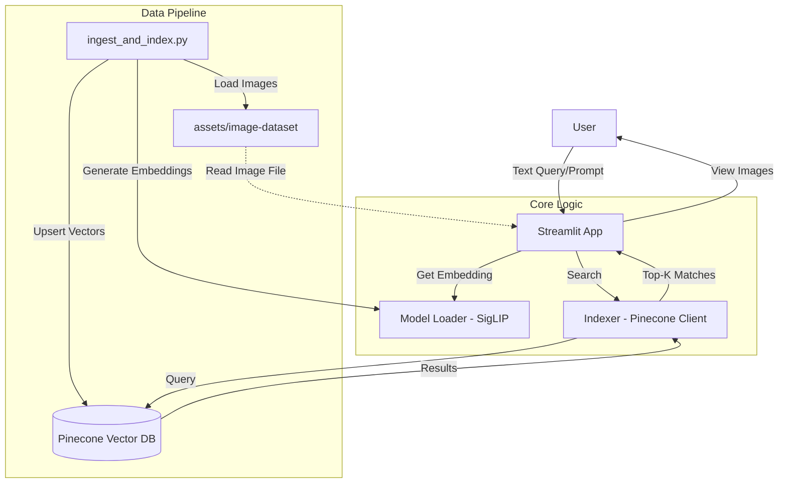

## zero-shot-vison-search

Zero-Shot Vision Search is a Semantic/Vector Image Search Engine project, a part of my learning and building series in Multi-modal LLM or Vision RAG, that aims to classify anything (Zero-Shot) just by checking if the image vector is semantically close to the text vector. 

## Introduction

Zero-Shot Vision Search is a semantic image retrieval engine capable of finding and classifying images based on natural language queries, without any explicit training on the target classes.

Unlike traditional image classifiers (ResNet, EfficientNet) that are limited to fixed categories (e.g., "1000 ImageNet classes"), this project leverages Multimodal Contrastive Learning to align visual and textual representations in a shared vector space. This allows the system to recognize any concept describable in language—from "a cyber-punk street at night" to "a happy golden retriever puppy."

This implementation utilizes Google's SigLIP (Sigmoid Loss for Language Image Pre-training), specifically the siglip-so400m-patch14-384 checkpoint, on the Unsplash Lite dataset. SigLIP represents the 2025 state-of-the-art standard for vision encoding, outperforming OpenAI's vanilla CLIP in zero-shot accuracy and computational efficiency by decoupling image-text pairing into independent binary classification tasks.


## Objectives

- Build a Zero-Shot Engine: Create a pipeline that accepts raw text and returns semantically relevant images with high precision.

- Demonstrate SigLIP Superiority: Utilize the Shape-Optimized (so400m) SigLIP model to showcase improved handling of edge cases compared to softmax-based CLIP models.

- Scalable Vector Search: Implement a retrieval architecture that can scan the Unsplash Lite dataset (25k+ high-quality images) in milliseconds.


## Dataset Setup

1.  **Download**: Go to [Unsplash Lite Dataset](https://unsplash.com/data/lite/latest) and download the dataset.
2.  **Extract**: Extract the images into the `assets/` directory.
    *   Note: The Unsplash Lite dataset provides URLs. It will need a script to download the actual images. For that, this project provides a script `download_images.py`.

## System Architecture



## Methodology

The Zero-Shot Vision Search pipeline consists of the following key steps:

1. **Image Collection & Preparation**
   - Download the Unsplash Lite dataset and extract images into the `assets/image-dataset/` directory.
   - Use the provided `download_images.py` script to automate image downloading if needed.
   - Store image metadata (e.g., URLs, captions, IDs) in `data/metadata.json` for efficient lookup.

2. **Embedding Generation**
   - Use the SigLIP (siglip-so400m-patch14-384) model to encode both images and text queries into a shared vector space.
   - For each image, generate a fixed-length embedding vector and store it for indexing.
   - Text queries from users are also converted into embedding vectors using the same model, ensuring semantic alignment.

3. **Vector Indexing**
   - Utilize Pinecone (or a similar vector database) to index all image embeddings.
   - The `ingest_and_index.py` script handles batch upserting of image vectors into the database.
   - The index supports efficient similarity search (e.g., cosine or dot-product) for large-scale datasets.


## 4. Semantic Search & Ranking

- When a user submits a text query, the system computes its embedding and queries the vector database for the most similar image vectors.
- The `ranker.py` module retrieves the top-K matches based on similarity scores.
- Results are re-ranked using the `cross-encoder/ms-marco-MiniLM-L-6-v2` model to improve relevance (e.g., using additional metadata or heuristics).

### Mathematical Concept

```markdown
Both images and text queries are encoded as high-dimensional vectors (embeddings) in $\mathbb{R}^n$ using the SigLIP model:

- $v_{image} \in \mathbb{R}^n$
- $v_{text} \in \mathbb{R}^n$

Semantic similarity between a query and an image is computed using cosine similarity:

$$
\mathrm{sim}(v_{text}, v_{image})
= \frac{v_{text} \cdot v_{image}}{\|v_{text}\| \, \|v_{image}\|}
$$

Alternatively, dot-product similarity can be used:

$$
\mathrm{sim}(v_{text}, v_{image}) = v_{text} \cdot v_{image}
$$

For top-K retrieval, similarity scores are computed between the query vector and each image vector:

$$
s_j = \mathrm{sim}(v_{text}, v_{image_j}), \quad j = 1, \dots, N
$$

The top-K images are then selected as:

$$
\text{Top-K} = \operatorname{argsort}_K(s_j)
$$

```markdown

5. **Frontend Visualization**
   - The Streamlit app provides an interactive interface for users to enter queries and view results.
   - Top-K matching images are displayed along with their metadata.
   - The app reads image files directly from the `assets/image-dataset/` directory for fast rendering.

6. **Zero-Shot Capability**
   - The system does not require retraining for new concepts; any text prompt can be used to search for semantically relevant images.
   - This is enabled by the contrastive learning approach of SigLIP, which aligns visual and textual modalities in a unified space.


## Model Evaluation Metrics
Below are the metrics for the model evaluation on Unsplash Lite dataset(15k images):


## Results

The following image demonstrates the effectiveness of the Zero-Shot Vision Search engine in retrieving semantically relevant images for a given text query:


*Figure: Example of top-K image retrieval results for a natural language query using the SigLIP-powered search engine.*
