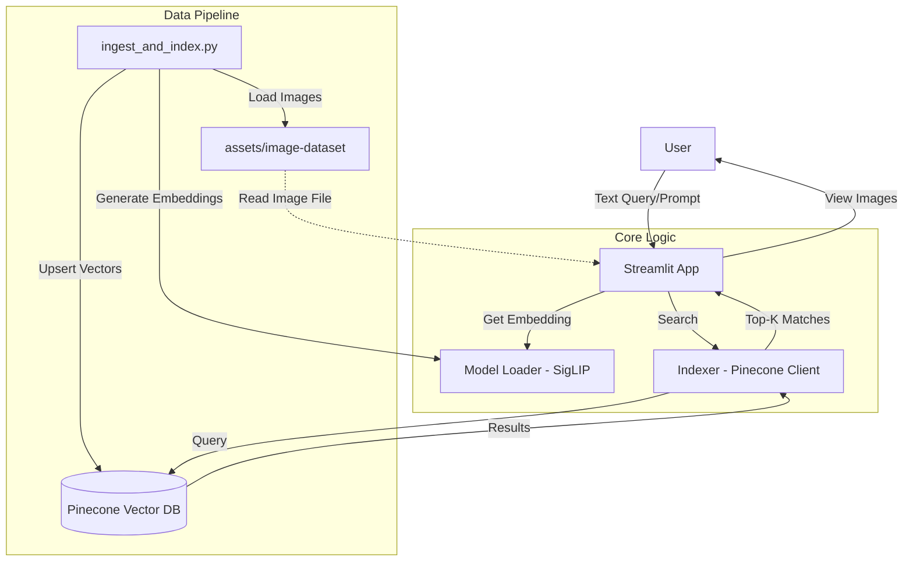

## zero-shot-vison-search

Zero-Shot Vision Search is a Semantic/Vector Image Search Engine project, a part of my learning and building series in Multi-modal LLM or Vision RAG, that aims to classify anything (Zero-Shot) just by checking if the image vector is semantically close to the text vector. 

## Introduction

Zero-Shot Vision Search is a semantic image retrieval engine capable of finding and classifying images based on natural language queries, without any explicit training on the target classes.

Unlike traditional image classifiers (ResNet, EfficientNet) that are limited to fixed categories (e.g., "1000 ImageNet classes"), this project leverages Multimodal Contrastive Learning to align visual and textual representations in a shared vector space. This allows the system to recognize any concept describable in language—from "a cyber-punk street at night" to "a happy golden retriever puppy."

This implementation utilizes Google's SigLIP (Sigmoid Loss for Language Image Pre-training), specifically the siglip-so400m-patch14-384 checkpoint, on the Unsplash Lite dataset. SigLIP represents the 2025 state-of-the-art standard for vision encoding, outperforming OpenAI's vanilla CLIP in zero-shot accuracy and computational efficiency by decoupling image-text pairing into independent binary classification tasks.

## Objectives

- Build a Zero-Shot Engine: Create a pipeline that accepts raw text and returns semantically relevant images with high precision.

- Demonstrate SigLIP Superiority: Utilize the Shape-Optimized (so400m) SigLIP model to showcase improved handling of edge cases compared to softmax-based CLIP models.

- Scalable Vector Search: Implement a retrieval architecture that can scan the Unsplash Lite dataset (25k+ high-quality images) in milliseconds.

## Dataset Setup

1.  **Download**: Go to [Unsplash Lite Dataset](https://unsplash.com/data/lite/latest) and download the dataset.
2.  **Extract**: Extract the images into the `assets/` directory.
    *   Note: The Unsplash Lite dataset provides URLs. It will need a script to download the actual images. For that, this project provides a script `download_images.py`.

## System Architecture

